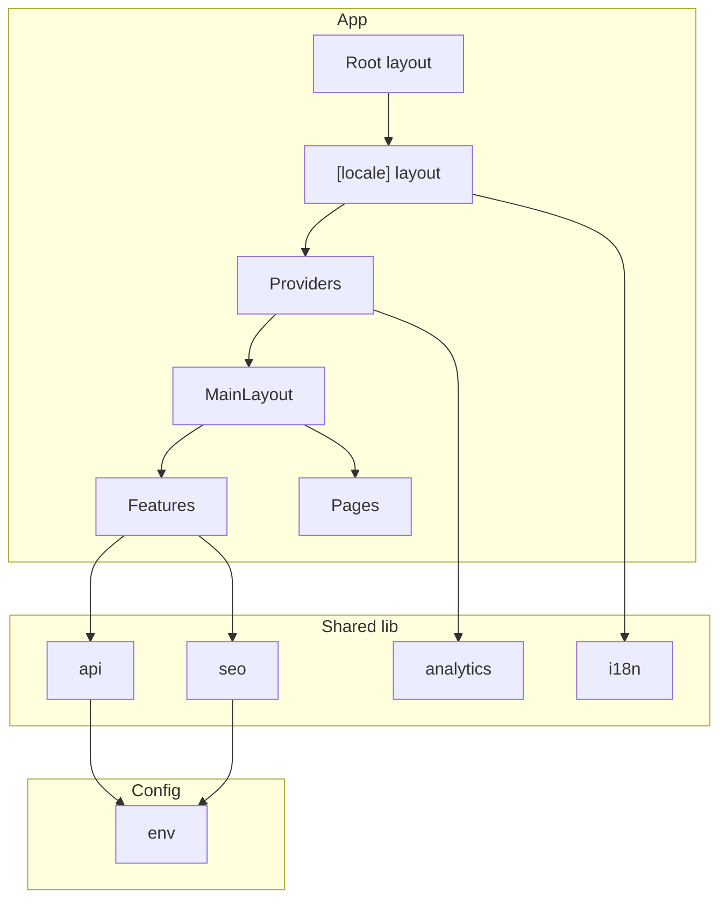

# CRDN Next.js Starter – Overview

This template is a production-ready Next.js starter with a feature-driven structure. It is scaffolded by **create-crdn-app** and includes authentication, i18n, API layer, React Query, SEO helpers, and analytics wiring out of the box.

## Architecture

- **Root layout**: Loads `globals.css` (Tailwind) and wraps the app in `NextIntlClientProvider` with locale and messages from the request.
- **[locale] layout**: Validates locale, calls `setRequestLocale`, and renders `Providers` (React Query), `PageViewTracker`, and `MainLayout`.
- **Proxy** (`src/proxy.ts`): Redirects paths without a locale to `/en` (or cookie value) and handles locale negotiation.

## Documentation index

- [Getting started](getting-started.md) – Create app, install, first run, env setup.
- [Project structure](project-structure.md) – Folder tree and what each area is for.
- [Environment](environment.md) – All env variables and when to set them.
- [API layer](api-layer.md) – HTTP client (`get`, `post`, `put`, `patch`, `del`) and base URL config.
- [React Query](react-query.md) – Provider, queryClient, queryKeys, and usage.
- [Authentication](authentication.md) – Auth feature: useAuth, LoginForm, authApi, guards.
- [Internationalization](internationalization.md) – next-intl, locales, messages, proxy, navigation, RTL.
- [SEO](seo.md) – createMetadata and usage in layout/pages.
- [Analytics](analytics.md) – trackPageView, trackEvent, PageViewTracker, wiring to GA/PostHog.
- [Adding features](adding-features.md) – Conventions, new feature slice, query keys, exports.
